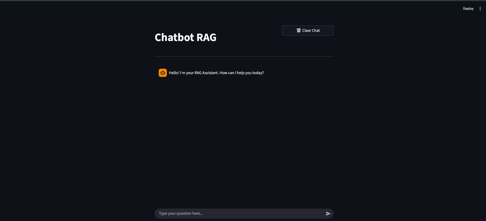
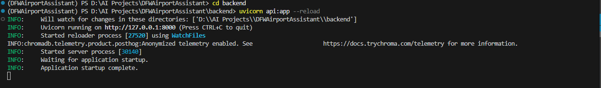

# DFW Airport Operations Intelligence Copilot - v1.0 (Baseline)

> **RAG-powered chatbot for DFW Airport HVAC maintenance operations**

A Retrieval-Augmented Generation (RAG) application that enables airport maintenance technicians to query DFW Airport operations manuals, design criteria, and HVAC maintenance documentation using natural language.

This baseline implementation establishes the foundational RAG architecture: document ingestion, vector search, and LLM-powered question answering with source attribution.

---

## Table of Contents

- [Overview](#overview)
- [Screenshots](#screenshots)
- [Features](#features)
- [Architecture](#architecture)
- [Tech Stack](#tech-stack)
- [Project Structure](#project-structure)
- [Prerequisites](#prerequisites)
- [Installation](#installation)
- [Configuration](#configuration)
- [Usage](#usage)
- [API Documentation](#api-documentation)
- [Implementation Details](#implementation-details)
- [Limitations](#limitations)

---

## Overview

Version 1.0 serves as the **baseline implementation** of a production-grade RAG pipeline. This version prioritizes architectural simplicity and core functionality validation before introducing advanced retrieval techniques in subsequent iterations.

The system implements a straightforward document retrieval flow: user queries are embedded, ChromaDB performs similarity search against indexed documents, and GPT-4o-mini generates answers grounded strictly in retrieved context.

### Baseline Scope

This baseline version validates:
- Document ingestion and chunking strategies
- Vector similarity search performance
- LLM integration with citation mechanisms
- API-based architecture for future extensibility
- End-to-end user interaction flow

Advanced features (reranking, query expansion, conversation memory) are intentionally deferred to v2.0 to maintain baseline simplicity.

---

## Screenshots

### Frontend - Chat Interface



*Streamlit-based chat interface with input field and message display. Users submit queries and receive AI-generated responses with source citations.*

### Backend - FastAPI Server



*FastAPI server initialization on port 8000. Console output confirms successful application startup and ChromaDB integration.*

---

## Features

### v1.0 Baseline Implementation

- **Automated Document Ingestion**: Directory-based loading of PDF, DOCX, and TXT files from `backend/files/`
- **Text Chunking**: RecursiveCharacterTextSplitter with 800-token chunks and 120-token overlap
- **Vector Similarity Search**: ChromaDB with k=3 retrieval using cosine similarity
- **LLM Integration**: OpenAI GPT-4o-mini with temperature=0 for deterministic outputs
- **Source Attribution**: Document title, page number, and content snippet returned with each answer
- **Streamlit Frontend**: Minimal chat interface with conversation history
- **Metadata Enrichment**: Document-level tags (airport, doc_type, topic) for future filtering

### Baseline Limitations

The following capabilities are **explicitly excluded** from v1.0 baseline:
- Reranking or relevance scoring of retrieved chunks
- Dynamic retrieval parameter adjustment (k is fixed at 3)
- Query preprocessing, expansion, or reformulation
- Conversation history or multi-turn context
- UI-based document upload (manual file placement required)
- Advanced error handling and retry mechanisms

---

## Architecture

```
┌─────────────┐
│   User      │
└──────┬──────┘
       │
       ▼
┌─────────────────────┐
│  Streamlit Frontend │ (app.py)
│  Port: 8501         │
└──────┬──────────────┘
       │ HTTP
       ▼
┌─────────────────────┐
│  FastAPI Backend    │ (api.py)
│  Port: 8000         │
└──────┬──────────────┘
       │
       ▼
┌─────────────────────┐
│  RAG Engine         │ (chatbot.py)
│  - Query Embedding  │
│  - Vector Search    │
│  - LLM Generation   │
└──────┬──────────────┘
       │
       ├──────────────┐
       ▼              ▼
┌──────────────┐  ┌──────────────┐
│  ChromaDB    │  │  OpenAI API  │
│  (Vectors)   │  │  (LLM)       │
└──────────────┘  └──────────────┘
```

---

## Tech Stack

| Component | Technology | Version | Purpose |
|-----------|-----------|---------|---------|
| **Backend Framework** | FastAPI | 0.121.3+ | Async API server |
| **Frontend Framework** | Streamlit | 1.51.0+ | Rapid UI prototyping |
| **Language Model** | OpenAI GPT-4o-mini | gpt-4o-mini | Answer generation |
| **Embeddings** | OpenAI | text-embedding-3-small | Document vectorization |
| **Vector Database** | ChromaDB | 1.3.5+ | Local vector persistence |
| **RAG Framework** | LangChain | 1.0.8+ | RAG pipeline orchestration |
| **Runtime** | Python | 3.12+ | Application runtime |
| **Package Manager** | UV | - | Dependency management |

---

## Project Structure

```
DFW-OPS-COPILOT/
├── backend/
│   ├── files/                          # Document corpus
│   │   ├── DFW_Design_Criteria_Manual_2025_FINAL.pdf
│   │   ├── DFW_Airport_Operations_Manual_-_4-1-2024.pdf
│   │   ├── HVAC-Design-Manual.pdf
│   │   ├── HVAC-LAWA-Guidelines.pdf
│   │   ├── hvac-preventive-maintenance-checklist.pdf
│   │   └── Context.txt
│   ├── api.py                          # FastAPI routes and endpoints
│   └── chatbot.py                      # RAG pipeline implementation
├── data/                               # ChromaDB persistence directory
│   └── .gitkeep
├── screenshots/                        # Documentation assets
│   ├── frontend_image.png
│   └── backend_image.png
├── .venv/                              # Python virtual environment
├── .env                                # Environment variables (gitignored)
├── .env.example                        # Environment variable template
├── .gitignore                          # Git ignore patterns
├── .python-version                     # Python version specification
├── app.py                              # Streamlit frontend application
├── pyproject.toml                      # UV project configuration
├── requirements.txt                    # Pip-compatible dependencies
├── uv.lock                             # UV dependency lock file
└── README.md                           # Project documentation
```

---

## Prerequisites

### System Requirements
- Python 3.12 or higher
- 4GB RAM minimum (ChromaDB in-memory operations)
- Internet connection (OpenAI API access)

### External Dependencies
- **OpenAI API Key**: Obtain from [OpenAI Platform](https://platform.openai.com)
- **Package Manager**: UV (recommended) or pip

---

## Installation

### Option 1: UV Package Manager (Recommended)

```bash
# Navigate to project directory
cd dfw-ops-copilot

# Install UV
pip install uv

# Install dependencies from lock file
uv sync

# Activate virtual environment
# Windows:
.venv\Scripts\activate
# Linux/Mac:
source .venv/bin/activate
```

### Option 2: pip Package Manager

```bash
# Navigate to project directory
cd dfw-ops-copilot

# Create virtual environment
python -m venv .venv

# Activate virtual environment
# Windows:
.venv\Scripts\activate
# Linux/Mac:
source .venv/bin/activate

# Install dependencies
pip install -r requirements.txt
```

---

## Configuration

### Environment Variables

Create `.env` file in project root:

```bash
cp .env.example .env
```

Configure OpenAI credentials:

```env
OPENAI_API_KEY=sk-proj-YOUR_OPENAI_API_KEY_HERE
```

**Security**: Never commit `.env` to version control. File is excluded via `.gitignore`.

### Document Corpus Setup

Place source documents in `backend/files/` directory. Supported formats:
- PDF (`.pdf`)
- Microsoft Word (`.docx`)
- Plain text (`.txt`)

**Baseline corpus includes:**
- DFW Design Criteria Manual (2025 Edition)
- DFW Airport Operations Manual (April 2024)
- HVAC Design Manual
- HVAC LAWA Guidelines
- HVAC Preventive Maintenance Checklist
- Context.txt (Equipment inventory and metadata)

---

## Usage

### Application Startup

The system requires two concurrent processes:

#### Process 1: Backend API Server

```bash
cd backend
uvicorn api:app --reload --port 8000
```

Expected output:
```
INFO:     Uvicorn running on http://127.0.0.1:8000 (Press CTRL+C to quit)
INFO:     Started reloader process [27520] using WatchFiles
INFO:     Started server process [30140]
INFO:     Waiting for application startup.
INFO:     Application startup complete.
```

Backend available at: `http://localhost:8000`

#### Process 2: Streamlit Frontend

```bash
streamlit run app.py
```

Frontend automatically opens at: `http://localhost:8501`

### Initial Document Indexing

On first execution, the system performs one-time document processing:

1. Loads all files from `backend/files/`
2. Splits documents using RecursiveCharacterTextSplitter (800 tokens, 120 overlap)
3. Generates embeddings via OpenAI `text-embedding-3-small`
4. Persists vectors to ChromaDB at `../data/`

**Processing time**: 2-3 minutes depending on corpus size. Subsequent startups use cached vectors.

### Example Queries

Representative queries for baseline testing:

```
What is the protocol for AHU filter replacement in Terminal C?

What temperature range should be maintained in passenger areas during summer?

How should HVAC technicians respond to a BAS alarm for Chiller C42 fault?

What are the design criteria for HVAC systems in Terminal D international terminal?
```

---

## API Documentation

### REST Endpoints

#### 1. Health Check
```http
GET /
```

**Response:**
```json
{
  "service": "RAG Assistant using FastAPI, OPENAI and Streamlit",
  "description": "Welcome to the Airport Assistant!",
  "status": "running"
}
```

#### 2. Document Retrieval
```http
GET /documents/{query}
```

**Parameters:**
- `query` (string, path): Search query text

**Response:**
```json
{
  "documents": [Document],
  "total": 3,
  "query": "HVAC filter replacement"
}
```

#### 3. Question Answering
```http
GET /ask?query={question}
```

**Parameters:**
- `query` (string, query parameter): User question

**Response:**
```json
{
  "query": "What is the temperature range for passenger areas?",
  "answer": "According to the DFW Operations Manual, passenger areas must maintain 72–76°F (22–25°C) year-round with 40–55% relative humidity.",
  "sources": [
    {
      "title": "DFW_Airport_Operations_Manual_-_4-1-2024.pdf",
      "page": "12",
      "snippet": "Maintain temp 72–76°F and 40–55% RH for all passenger-facing areas..."
    }
  ]
}
```

### Interactive Documentation

- **Swagger UI**: `http://localhost:8000/docs` (OpenAPI specification)
- **ReDoc**: `http://localhost:8000/redoc` (Alternative documentation UI)

---

## Implementation Details

### Document Processing Pipeline

1. **Loading**: `DirectoryLoader` recursively scans `backend/files/` for PDF/DOCX/TXT
2. **Parsing**: 
   - PDF: PyMuPDF extraction
   - DOCX: Docx2txt parser
   - TXT: Direct text loading
3. **Chunking**: `RecursiveCharacterTextSplitter`
   - `chunk_size=800` tokens
   - `chunk_overlap=120` tokens (15% overlap to preserve context)
4. **Metadata Enrichment**: Auto-populated fields per chunk:
   - `doc_title`: Source filename
   - `airport`: "dfw"
   - `doc_type`: Inferred from filename pattern
   - `topic`: Document category
   - `page`: Page number (when available)
5. **Embedding**: OpenAI `text-embedding-3-small` (1536 dimensions)
6. **Storage**: ChromaDB collection named `documents` with persistent storage at `../data/`

### Retrieval Configuration

```python
retriever = chroma.as_retriever(
    search_type="similarity",           # Cosine similarity
    search_kwargs={'k': 3}              # Fixed at 3 chunks
)
```

**Retrieval Strategy**: Cosine similarity between query embedding and document chunk embeddings. Top-k=3 chunks selected without reranking.

### Prompt Engineering

The baseline employs a strict grounding strategy to minimize hallucination:

**Key prompt directives:**
- Answer ONLY from provided context
- If context insufficient, explicitly state "I don't know based on the available documentation"
- Cite source document type (OPS Manual vs Design Criteria Manual)
- Include document name and page number in citations
- Never fabricate procedures, specifications, or contact information

**Prompt length**: ~1500 tokens (including instructions, context placeholder, and examples)

**Temperature**: 0 (deterministic outputs for consistency)

---

## Limitations

### v1.0 Baseline Constraints

This baseline version has the following **known limitations** by design:

1. **No Retrieval Reranking**  
   Retrieved chunks are not reranked by relevance. ChromaDB similarity scores alone determine ranking.

2. **Fixed Retrieval Count (k=3)**  
   System always retrieves exactly 3 chunks regardless of query complexity or context requirements.

3. **No Query Preprocessing**  
   User queries are embedded directly without:
   - Spelling correction
   - Query expansion
   - Synonym handling
   - Abbreviation normalization

4. **Stateless Conversations**  
   Each query is independent. No conversation history or multi-turn context tracking.

5. **Manual Document Management**  
   Adding/removing documents requires:
   - Manual file placement in `backend/files/`
   - Server restart to trigger re-indexing
   - No UI-based document upload capability

6. **Single Vector Store Path**  
   ChromaDB persistence location hardcoded to `../data/`. Cannot maintain multiple document collections without code modification.

7. **Basic Error Handling**  
   Limited retry logic for API failures. No graceful degradation for rate limits or service outages.

8. **No Cost Controls**  
   No built-in monitoring or limits for OpenAI API usage costs.

### Rationale for Limitations

These constraints are **intentional** in the baseline version to:
- Validate core RAG architecture before adding complexity
- Establish performance baselines for future comparison
- Minimize initial development time
- Simplify debugging and troubleshooting


---

## Troubleshooting

### Common Issues and Resolutions

**Issue**: `OPENAI_API_KEY not found in environment variables`  
**Resolution**: Verify `.env` file exists in project root directory with valid API key. Restart application after creating/modifying `.env`.

**Issue**: `No module named 'langchain'`  
**Resolution**: Ensure virtual environment is activated. Re-run `uv sync` or `pip install -r requirements.txt`.

**Issue**: ChromaDB collection shows 0 documents  
**Resolution**: Delete `data/` directory entirely. Restart backend to trigger full re-indexing.

**Issue**: First query takes 2-5 minutes  
**Resolution**: Expected behavior. First query triggers document loading and embedding generation. Subsequent queries complete in ~2 seconds.

**Issue**: Backend fails to start - port 8000 already in use  
**Resolution**: Identify process using port 8000 or specify alternate port: `uvicorn api:app --port 8001`

**Issue**: OpenAI API rate limit errors  
**Resolution**: v1.0 baseline has no rate limiting. Implement request throttling or upgrade OpenAI tier.


---

## Contributing

Development follows standard pull request workflow:

1. Create feature branch from `v1` baseline
2. Implement changes with unit tests
3. Update documentation to reflect changes
4. Submit pull request with descriptive commit messages

---

## License

Internal use only. All DFW Airport documentation remains property of Dallas Fort Worth International Airport.

---

**Technology Stack**: FastAPI · LangChain · ChromaDB · OpenAI · Streamlit
